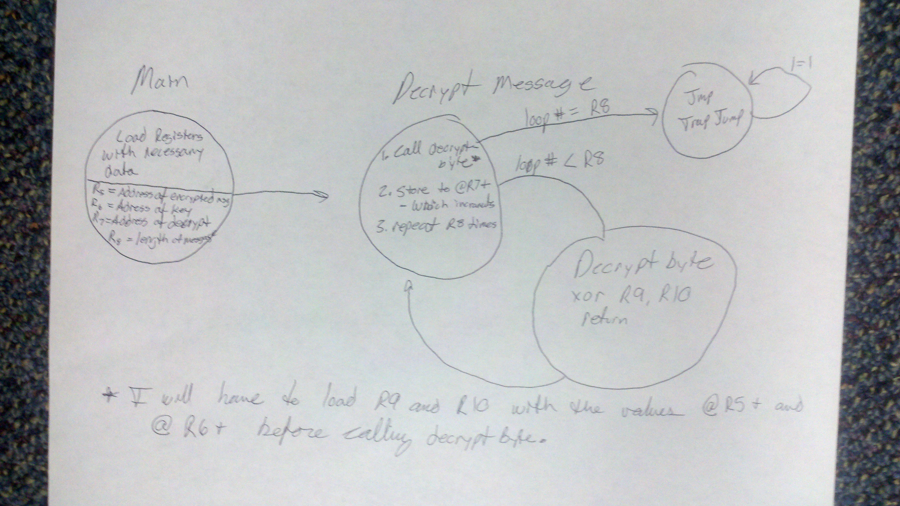
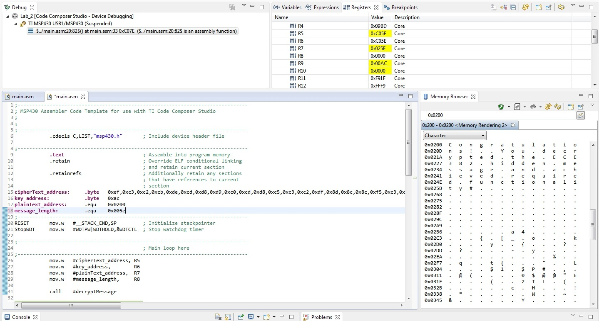
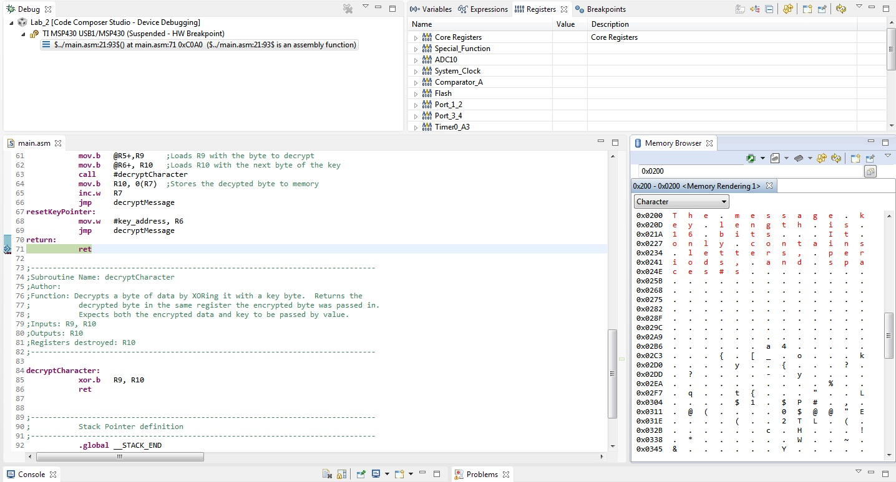
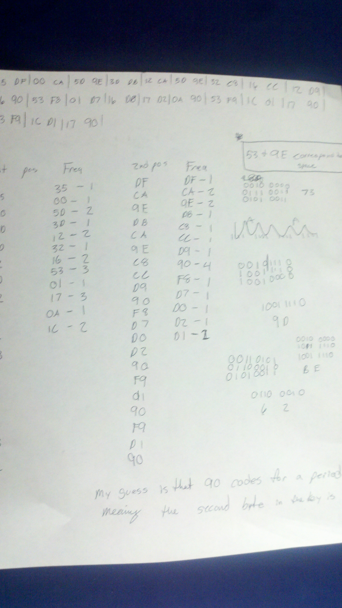
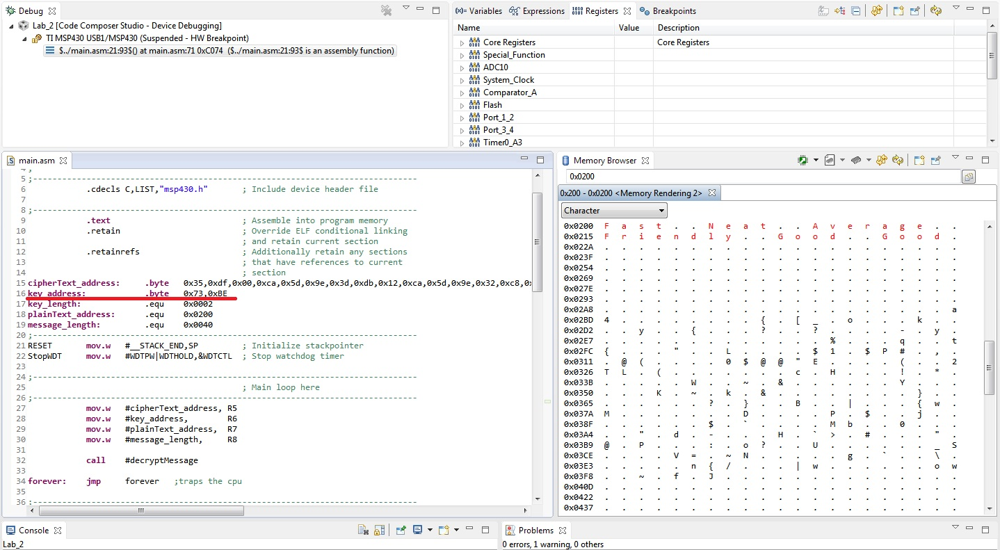

ECE382_Lab2
===========

An XOR decryption program

## Objectives and Purpose

Write a program that can decrypt an XOR encrypted string given the cipher text and key. Emphasis will be placed on utilizing
sub routines for this lab. I will have to also need to practice call-by-value and call-by-reference in this exercise. 

## Implementation Plan



## Code
### Initialization

```
			mov.w   #cipherText_address, R5
			mov.w	#key_address,        R6
			mov.w	#plainText_address,  R7
			mov.w	#message_length,	 R8

			call    #decryptMessage

forever:    jmp     forever   ;traps the cpu
```

This code gets everything ready to be passed into the workhorse subroutine decryptMessage which will be discussed later.
R5 holds a pointer to the beginning of the cipher text stored in rom. R6 is a pointer to the key stored in rom. R7 holds
the constant 0x0200 which is where we want to begin writing the decoded plain text in RAM. And R8 holds the message length.
Often I was too lazy to count out exactly how long the cipher text was so I'd make message length longer than was necessary
to make sure the whole thing was decoded. This worked well. 

### decryptMessage

```
decryptMessage:
			tst.w	R8			; Checks to see if we've decrypted the entire message
			jz		return
			dec.b 	R8			; Decrement the loop counter/message length

			mov.w	#key_address, R11	; if(keyPointer(R6)-keyAddress==keyLength) then keyPointer = keyAddress
			mov.w	R6, R12				; Which essentially loops the key
			sub.w	R11, R12
			cmp.b	#key_length, R12
			jeq		resetKeyPointer

			mov.b	@R5+,R9	 	;Loads R9 with the byte to decrypt
			mov.b	@R6+, R10	;Loads R10 with the next byte of the key
			call	#decryptCharacter
			mov.b	R10, 0(R7)	;Stores the decypted byte to memory
			inc.w	R7
			jmp		decryptMessage
resetKeyPointer:
			mov.w	#key_address, R6
			jmp		decryptMessage
return:
            ret
```
Inputs: cipherText_address, key_address, plainText_address, message_length
Outputs: plainText
Registers destroyed: R8
	
This block of code did the heavy lifting in this assignment. It's operation can be broken down into three parts. The
first subsection is a while loop that returns from the subroutine once the number of iterations is equal to the length
of the message. 

The second section was added to fulfill B functionality requirements. The key length is loaded into R11
and the current pointer position in the key is loaded into R11 so as not to destroy R6. We subtract the pointer postion
from the key address the numerical position that R6 is pointing to in the key. If R6 is at the end of the key (or
R6 minus the key address equal to the key length) then R6 is reset by setting it equal to the start of the key.

The final block prepares R9 and R10 for the decryptCharacter subroutine by loading R9 with the value in memory at 
R5 and R10 with the value in memory at R6. Post increments keep the pointers moving along the strings. 

### Next decryptCharacter
	
```
decryptCharacter:
			xor.b	R9, R10
            ret
```
Inputs: R9, R10
Outputs: R10
Registers destroyed: R10

This subroutine was the easy block to program by far. All it does is XOR R9 by R10 and store the result to R10.
R10 is then written to memory upon returning to decryptMessage.
	
### Forever

```
forever:	jmp   forever
```
Inputs: none
Outputs: none
Registers destroyed: none	

"forever" is a simple CPU trap to trap the CPU once the message is decoded.
	
## Debugging/Testing

### Methodology

I copied and pasted the cipher text and key into my code for the first two functionality tests. If I got english out
when viewed by the memory browser set to view characters then I knew I was successful. For the final functionality
test I copied and pasted only the cipher text in as the key was not known. I tried different keys based on a frequency
analysis, rebuilt my code, executed it, and analysed the output. I knew that I had selected the correct key when I got
english as an output. 

### Commit 1

Required functionality was fairly easy. The only snag that I ran into was using inc.b when trying to write my plain
text to memory. inc.b will destroy the upper two bytes in the register and the solution is to just use inc.w. Below is
a screenshot of the output from the first decrypted cipher text.



### Commit 2 / Final Commit

This implementation went more or less as planned. I took a little longer to think about what I needed to do before coding
and it ended up saving me time in the end. The only bug was caused by me forgeting how sub.w worked. The source gets 
subtracted from the destination which is somewhat backwards from how you enter it in. This problem was easily identified
by placing a breakpoint at the line in question and swapping the two registers in the line (I didn't care which register
got written to). Below is a screenshot of the second decrypted chipher text.



### A functionality

As I understood the lab, the A functionality could be done, at least in part, by hand. After doing some cursory research
on the problem I realized that an XOR encoding with a known key length was basically the same as a simple subsitition 
cipher. I knew from working with these types of ciphers could be easily solved using frequency analysis. Knowing that the
key was 16 bits (2 bytes) allowed me to break the code down by which byte it was XOR'd with. Odd bytes of the cipher text
were encoded with the first byte in the key and the even bytes of the cipher text were encoded with the second byte of the
key. After splitting up the ciphertext in this way I found the most common characters for characters encoded with the first
byte of the key to be 0x53 and 0x17 which both occured 3 times, and 0x90, ocuring 4 times, for characters encoded with the 
second byte of the key. The crib given in addition to the key length in the second message was very useful in my frequency
analysis. I reasoned that every word, except the last, would have a space and therefore be the most commonly occuring 
character. After a few guess and checks, I made the correct guess that 0x53 and 0x9E (I guessed these based on frequency and
position in the string) coded for spaces. I looked up space in an ASCII table and worked backwards to find out what it needed
to be XOR'd with to produce 0x53 and 0x9E which was the key. I entered this key into my B Functionality programe and viola!
Below are pictures of my handwork as well as the output for A functionality.

#### Front of my work
Just to give you an idea of what it looked like



#### Output Screenshot



## Conclusion and Lessons Learned

I learned from my mistakes of jumping into a lab without thinking last time and as a result I was able to complete this lab 
in a few hours with only minor hiccups. Granted it was an easier lab, I'm still please that I took my time and was rewarded
with good code and less hassle. 

Documentation: I used [this](http://www.angelfire.com/electronic/kfrank/xor/index.html) website to better understand the
process of breaking an XOR encryption. 
